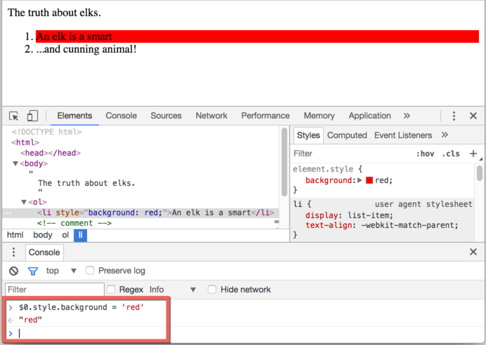

# DOM tree

The backbone of an HTML document is tags.

According to the Document Object Model (DOM), every HTML tag is an object. Nested tags are  "children" of the enclosing one. The text inside a tag is an object as well.

All these objects are accessible using JavaScript, and we can use them to modify the page.

For example, `document.body` is the object representing the `<body>` tag.

Running this code will make the `<body>` red for 3 seconds:

```js run
document.body.style.background = 'red'; // make the background red

setTimeout(() => document.body.style.background = '', 3000); // return back
```

That was just a glimpse of the DOM's power. Soon we'll learn more ways to manipulate the DOM, but first we need to know about its structure.

## An example of the DOM

Let's start with the following simple document:

```html run no-beautify
<!DOCTYPE HTML>
<html>
<head>
  <title>About elks</title>
</head>
<body>
  The truth about elks.
</body>
</html>
```

The DOM represents HTML as a tree structure of tags. Here's how it looks:

<div class="domtree"></div>

<script>
let node1 = {"name":"HTML","nodeType":1,"children":[{"name":"HEAD","nodeType":1,"children":[{"name":"#text","nodeType":3,"content":"\n    "},{"name":"TITLE","nodeType":1,"children":[{"name":"#text","nodeType":3,"content":"About elks"}]},{"name":"#text","nodeType":3,"content":"\n  "}]},{"name":"#text","nodeType":3,"content":"\n  "},{"name":"BODY","nodeType":1,"children":[{"name":"#text","nodeType":3,"content":"\n  The truth about elks."}]}]}

drawHtmlTree(node1, 'div.domtree', 690, 320);
</script>

```online
On the picture above, you can click on element nodes and their children will open/collapse.
```

Every tree node is an object.

Tags are *element nodes* (or just elements) and form the tree structure: `<html>` is at the root, then `<head>` and `<body>` are its children, etc.

The text inside elements forms *text nodes*, labelled as `#text`. A text node contains only a string. It may not have children and is always a leaf of the tree.

For instance, the `<title>` tag has the text `"About elks"`.

Please note the special characters in text nodes:

- a newline: `↵` (in JavaScript known as `\n`)
- a space: `␣`

Spaces and newlines are totally valid characters, like letters and digits. They form text nodes and become a part of the DOM. So, for instance, in the example above the `<head>` tag contains some spaces before `<title>`, and that text becomes a `#text` node (it contains a newline and some spaces only).

There are only two top-level exclusions:
1. Spaces and newlines before `<head>` are ignored for historical reasons.
2. If we put something after `</body>`, then that is automatically moved inside the `body`, at the end, as the HTML spec requires that all content must be inside `<body>`. So there can't be any spaces after `</body>`.

In other cases everything's straightforward -- if there are spaces (just like any character) in the document, then they become text nodes in the DOM, and if we remove them, then there won't be any.

Here are no space-only text nodes:

```html no-beautify
<!DOCTYPE HTML>
<html><head><title>About elks</title></head><body>The truth about elks.</body></html>
```

<div class="domtree"></div>

<script>
let node2 = {"name":"HTML","nodeType":1,"children":[{"name":"HEAD","nodeType":1,"children":[{"name":"TITLE","nodeType":1,"children":[{"name":"#text","nodeType":3,"content":"About elks"}]}]},{"name":"BODY","nodeType":1,"children":[{"name":"#text","nodeType":3,"content":"The truth about elks."}]}]}

drawHtmlTree(node2, 'div.domtree', 690, 210);
</script>

```smart header="Spaces at string start/end and space-only text nodes are usually hidden in tools"
Browser tools (to be covered soon) that work with DOM usually do not show spaces at the start/end of the text and empty text nodes (line-breaks) between tags.

Developer tools save screen space this way.

On further DOM pictures we'll sometimes omit them when they are irrelevant. Such spaces usually do not affect how the document is displayed.
```


## See it for yourself

To see the DOM structure in real-time, try [Live DOM Viewer](http://software.hixie.ch/utilities/js/live-dom-viewer/). Just type in the document, and it will show up as a DOM at an instant.

Another way to explore the DOM is to use the browser developer tools. Actually, that's what we use when developing.

To do so, open the web page [elks.html](elks.html), turn on the browser developer tools and switch to the Elements tab.

It should look like this:


You can see the DOM, click on elements, see their details and so on.

Please note that the DOM structure in developer tools is simplified. Text nodes are shown just as text. And there are no "blank" (space only) text nodes at all. That's fine, because most of the time we are interested in element nodes.

Clicking the <span class="devtools" style="background-position:-328px -124px"></span> button in the left-upper corner allows us to choose a node from the webpage using a mouse (or other pointer devices) and "inspect" it (scroll to it in the Elements tab). This works great when we have a huge HTML page (and corresponding huge DOM) and would like to see the place of a particular element in it.

Another way to do it would be just right-clicking on a webpage and selecting "Inspect" in the context menu.


At the right part of the tools there are the following subtabs:
- **Styles** -- we can see CSS applied to the current element rule by rule, including built-in rules (gray). Almost everything can be edited in-place, including the dimensions/margins/paddings of the box below.
- **Computed** -- to see CSS applied to the element by property: for each property we can see a rule that gives it (including CSS inheritance and such).
- **Event Listeners** -- to see event listeners attached to DOM elements (we'll cover them in the next part of the tutorial).
- ...and so on.

The best way to study them is to click around. Most values are editable in-place.

## Interaction with console

As we work the DOM, we also may want to apply JavaScript to it. Like: get a node and run some code to modify it, to see the result. Here are few tips to travel between the Elements tab and the console.

For the start:

1. Select the first `<li>` in the Elements tab.
2. Press `key:Esc` -- it will open console right below the Elements tab.

Now the last selected element is available as `$0`, the previously selected is `$1` etc.

We can run commands on them. For instance, `$0.style.background = 'red'` makes the selected list item red, like this:



That's how to get a node from Elements in Console.

There's also a road back. If there's a variable referencing a DOM node, then we can use the command `inspect(node)` in Console to see it in the Elements pane.

Or we can just output the DOM node in the console and explore "in-place", like `document.body` below:


That's for debugging purposes of course. From the next chapter on we'll access and modify DOM using JavaScript.

The browser developer tools are a great help in development: we can explore the DOM, try things and see what goes wrong.
