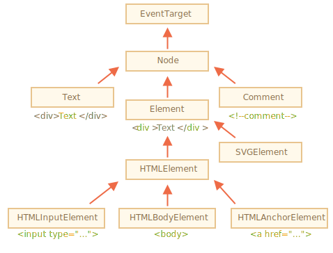

# Node properties: type, tag and contents

Let's get a more in-depth look at DOM nodes.

In this chapter we'll see more into what they are and learn their most used properties.

## DOM node classes

Different DOM nodes may have different properties. For instance, an element node corresponding to tag `<a>` has link-related properties, and the one corresponding to `<input>` has input-related properties and so on. Text nodes are not the same as element nodes. But there are also common properties and methods between all of them, because all classes of DOM nodes form a single hierarchy.

Each DOM node belongs to the corresponding built-in class.

The root of the hierarchy is [EventTarget](https://dom.spec.whatwg.org/#eventtarget), that is inherited by  [Node](http://dom.spec.whatwg.org/#interface-node), and other DOM nodes inherit from it.

Here's the picture, explanations to follow:



The classes are:

- [EventTarget](https://dom.spec.whatwg.org/#eventtarget) -- is the root "abstract" class. Objects of that class are never created. It serves as a base, so that all DOM nodes support so-called "events", we'll study them later.
- [Node](http://dom.spec.whatwg.org/#interface-node) -- is also an "abstract" class, serving as a base  for DOM nodes. It provides the core tree functionality: `parentNode`, `nextSibling`, `childNodes` and so on (they are getters). Objects of `Node` class are never created. But there are concrete node classes that inherit from it, namely: `Text` for text nodes, `Element` for element nodes and more exotic ones like `Comment` for comment nodes.
- [Element](http://dom.spec.whatwg.org/#interface-element) -- is a base class for DOM elements. It provides element-level navigation like `nextElementSibling`, `children` and searching methods like `getElementsByTagName`, `querySelector`. A  browser supports not only HTML, but also XML and SVG. The `Element` class serves as a base for more specific classes: `SVGElement`, `XMLElement` and `HTMLElement`.
- [HTMLElement](https://html.spec.whatwg.org/multipage/dom.html#htmlelement) -- is finally the basic class for all HTML elements. It is inherited by concrete HTML elements:
    - [HTMLInputElement](https://html.spec.whatwg.org/multipage/forms.html#htmlinputelement) -- the class for `<input>` elements,
    - [HTMLBodyElement](https://html.spec.whatwg.org/multipage/semantics.html#htmlbodyelement) -- the class for `<body>` elements,
    - [HTMLAnchorElement](https://html.spec.whatwg.org/multipage/semantics.html#htmlanchorelement) -- the class for `<a>` elements,
    - ...and so on, each tag has its own class that may provide specific properties and methods.

So, the full set of properties and methods of a given node comes as the result of the inheritance.

For example, let's consider the DOM object for an `<input>` element. It belongs to [HTMLInputElement](https://html.spec.whatwg.org/multipage/forms.html#htmlinputelement) class.

It gets properties and methods as a superposition of (listed in inheritance order):

- `HTMLInputElement` -- this class provides input-specific properties,
- `HTMLElement` -- it provides common HTML element methods (and getters/setters),
- `Element` -- provides generic element methods,
- `Node` -- provides common DOM node properties,.
- `EventTarget` -- gives the support for events (to be covered),
- ...and finally it inherits from `Object`, so "plain object" methods like `hasOwnProperty` are also available.

To see the DOM node class name, we can recall that an object usually has the `constructor` property. It references the class constructor, and `constructor.name` is its name:

```js run
alert( document.body.constructor.name ); // HTMLBodyElement
```

...Or we can just `toString` it:

```js run
alert( document.body ); // [object HTMLBodyElement]
```

We also can use `instanceof` to check the inheritance:

```js run
alert( document.body instanceof HTMLBodyElement ); // true
alert( document.body instanceof HTMLElement ); // true
alert( document.body instanceof Element ); // true
alert( document.body instanceof Node ); // true
alert( document.body instanceof EventTarget ); // true
```

As we can see, DOM nodes are regular JavaScript objects. They use prototype-based classes for inheritance.

That's also easy to see by outputting an element with `console.dir(elem)` in a browser. There in the console you can see `HTMLElement.prototype`, `Element.prototype` and so on.

```smart header="`console.dir(elem)` versus `console.log(elem)`"
Most browsers support two commands in their developer tools: `console.log` and `console.dir`. They output their arguments to the console. For JavaScript objects these commands usually do the same.

But for DOM elements they are different:

- `console.log(elem)` shows the element DOM tree.
- `console.dir(elem)` shows the element as a DOM object, good to explore its properties.

Try it on `document.body`.
```

```
smart header="IDL in the spec"
In the specification, DOM classes aren't described by using JavaScript, but a special [Interface description language](https://en.wikipedia.org/wiki/Interface_description_language) (IDL), that is usually easy to understand.

In IDL all properties are prepended with their types. For instance, `DOMString`, `boolean` and so on.

Here's an excerpt from it, with comments:

```js
// Define HTMLInputElement
*!*
// The colon ":" means that HTMLInputElement inherits from HTMLElement
*/!*
interface HTMLInputElement: HTMLElement {
  // here go properties and methods of <input> elements

*!*
  // "DOMString" means that the value of a property is a string
*/!*
  attribute DOMString accept;
  attribute DOMString alt;
  attribute DOMString autocomplete;
  attribute DOMString value;

*!*
  // boolean value property (true/false)
  attribute boolean autofocus;
*/!*
  ...
*!*
  // now the method: "void" means that the method returns no value
*/!*
  void select();
  ...
}
```

## innerHTML: the contents

The [innerHTML](https://w3c.github.io/DOM-Parsing/#widl-Element-innerHTML) property allows to get the HTML inside the element as a string.

We can also modify it. So it's one of the most powerful ways to change the page.

The example shows the contents of `document.body` and then replaces it completely:

```html run
<body>
  <p>A paragraph</p>
  <div>A div</div>

  <script>
    alert( document.body.innerHTML ); // read the current contents
    document.body.innerHTML = 'The new BODY!'; // replace it
  </script>

</body>
```

We can try to insert invalid HTML, the browser will fix our errors:

```html run
<body>

  <script>
    document.body.innerHTML = '<b>test'; // forgot to close the tag
    alert( document.body.innerHTML ); // <b>test</b> (fixed)
  </script>

</body>
```

```
smart header="Scripts don't execute"
If `innerHTML` inserts a `<script>` tag into the document -- it becomes a part of HTML, but doesn't execute.
```

## outerHTML: full HTML of the element

The `outerHTML` property contains the full HTML of the element. That's like `innerHTML` plus the element itself.

Here's an example:

```html run
<div id="elem">Hello <b>World</b></div>

<script>
  alert(elem.outerHTML); // <div id="elem">Hello <b>World</b></div>
</script>
```

**Beware: unlike `innerHTML`, writing to `outerHTML` does not change the element. Instead, it replaces it as a whole in the outer context.**

Yeah, sounds strange, and strange it is, that's why we make a separate note about it here. Take a look.

Consider the example:

```html run
<div>Hello, world!</div>

<script>
  let div = document.querySelector('div');

*!*
  // replace div.outerHTML with <p>...</p>
*/!*
  div.outerHTML = '<p>A new element</p>'; // (*)

*!*
  // Wow! The div is still the same!
*/!*
  alert(div.outerHTML); // <div>Hello, world!</div> (**)
</script>
```

Looks really odd, right?

In the line `(*)` we replaced `div` with `<p>A new element</p>`. In the outer document we can see the new content instead of the `<div>`. But, as we can see in line `(**)`, the old `div` variable is still the same!

The `outerHTML` assignment does not modify the DOM element, but removes it from the outer context and inserts a new piece of HTML instead of it.

So what happened in `div.outerHTML=...` is:
- `div` was removed from the document.
- Another HTML `<p>A new element</p>` was inserted instead.
- `div` still has the old value. The new HTML wasn't saved to any variable.

It's so easy to make an error here: modify `div.outerHTML` and then continue to work with `div` as if it had the new content in it. But it doesn't. Such thing is correct for `innerHTML`, but not for `outerHTML`.

We can write to `elem.outerHTML`, but should keep in mind that it doesn't change the element we're writing to. It creates the new HTML on its place instead. We can get references to new elements by querying DOM.

