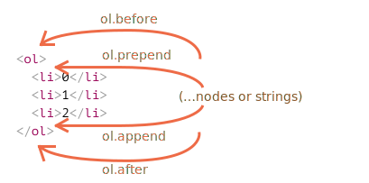

# Modifying the document

DOM modifications is the key to create "live" pages.

Here we'll see how to create new elements "on the fly" and modify the existing page content.

## Creating an element

To create DOM nodes, there are two methods:

`document.createElement(tag)`
: Creates a new *element node* with the given tag:

    ```js
    let div = document.createElement('div');
    ```

`document.createTextNode(text)`
: Creates a new *text node* with the given text:

    ```js
    let textNode = document.createTextNode('Here I am');
    ```

### Creating the message

In our case the message is a `div` with `alert` class and the HTML in it:

```js
let div = document.createElement('div');
div.className = "alert";
div.innerHTML = "<strong>Hi there!</strong> You've read an important message.";
```

We created the element, but as of now it's only in a variable. We can't see the element on the page, as it's not yet a part of the document.

## Insertion methods

To make the `div` show up, we need to insert it somewhere into `document`. For instance, in `document.body`.

There's a special method `append` for that: `document.body.append(div)`.

Here's the full code:

```html run height="80"
<style>
.alert {
  padding: 15px;
  border: 1px solid #d6e9c6;
  border-radius: 4px;
  color: #3c763d;
  background-color: #dff0d8;
}
</style>

<script>
  let div = document.createElement('div');
  div.className = "alert";
  div.innerHTML = "<strong>Hi there!</strong> You've read an important message.";

*!*
  document.body.append(div);
*/!*
</script>
```

This set of methods provides more ways to insert:

- `node.append(...nodes or strings)` -- append nodes or strings at the end of `node`,
- `node.prepend(...nodes or strings)` -- insert nodes or strings into the beginning of `node`,
- `node.before(...nodes or strings)` –- insert nodes or strings before the `node`,
- `node.after(...nodes or strings)` –- insert nodes or strings after the `node`,
- `node.replaceWith(...nodes or strings)` –- replaces `node` with the given nodes or strings.

Here's an example of using these methods to add items to a list and the text before/after it:

```html autorun
<ol id="ol">
  <li>0</li>
  <li>1</li>
  <li>2</li>
</ol>

<script>
  ol.before('before'); // insert string "before" before <ol>
  ol.after('after'); // insert string "after" after <ol>

  let liFirst = document.createElement('li');
  liFirst.innerHTML = 'prepend';
  ol.prepend(liFirst); // insert liFirst at the beginning of <ol>

  let liLast = document.createElement('li');
  liLast.innerHTML = 'append';
  ol.append(liLast); // insert liLast at the end of <ol>
</script>
```

Here's a visual picture what methods do:



So the final list will be:

```html
before
<ol id="ol">
  <li>prepend</li>
  <li>0</li>
  <li>1</li>
  <li>2</li>
  <li>append</li>
</ol>
after
```

These methods can insert multiple lists of nodes and text pieces in a single call.

For instance, here a string and an element are inserted:

```html run
<div id="div"></div>
<script>
  div.before('<p>Hello</p>', document.createElement('hr'));
</script>
```

All text is inserted *as text*.

So the final HTML is:

```html run
*!*
&lt;p&gt;Hello&lt;/p&gt;
*/!*
<hr>
<div id="div"></div>
```

In other words, strings are inserted in a safe way, like `elem.textContent` does it.

So, these methods can only be used to insert DOM nodes or text pieces.

But what if we want to insert HTML "as html", with all tags and stuff working, like `elem.innerHTML`?

## Node removal

To remove a node, there's a method `node.remove()`.

Let's make our message disappear after a second:

```html run untrusted
<style>
.alert {
  padding: 15px;
  border: 1px solid #d6e9c6;
  border-radius: 4px;
  color: #3c763d;
  background-color: #dff0d8;
}
</style>

<script>
  let div = document.createElement('div');
  div.className = "alert";
  div.innerHTML = "<strong>Hi there!</strong> You've read an important message.";

  document.body.append(div);
*!*
  setTimeout(() => div.remove(), 1000);
*/!*
</script>
```

Please note: if we want to *move* an element to another place -- there's no need to remove it from the old one.

**All insertion methods automatically remove the node from the old place.**

For instance, let's swap elements:

```html run height=50
<div id="first">First</div>
<div id="second">Second</div>
<script>
  // no need to call remove
  second.after(first); // take #second and after it insert #first
</script>
```
